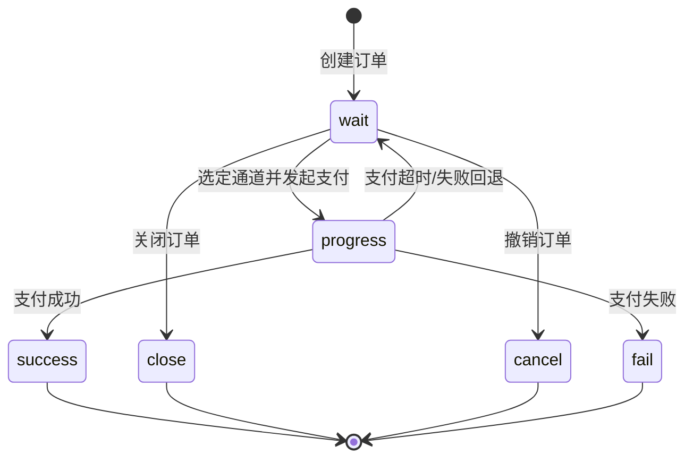

# 交易状态

> 以下编码均取自开源版真实枚举类,以代码为准。

## 支付状态 PayStatusEnum

字典: `pay_status`

| code | 含义 | 说明 |
| ---- | ---- | ---- |
| `wait` | 待支付 | 未指定通道和支付方式等信息 |
| `progress` | 支付中 | 选中通道和支付方式后发起调用 |
| `success` | 成功 | 支付成功 |
| `close` | 关闭 | 支付关闭 |
| `cancel` | 撤销 | 支付撤销 |
| `timeout` | 超时 | 订单超时后设置的中间流转状态 |
| `fail` | 失败 | 支付失败 |

## 支付状态机

## 交易状态 TradeStatusEnum

字典: `trade_status`

| code | 含义 | 说明 |
| ---- | ---- | ---- |
| `progress` | 执行中 | 交易处理中 |
| `success` | 成功 | 交易成功完成 |
| `fail` | 失败 | 交易失败 |
| `closed` | 关闭 | 交易已关闭 |
| `revoked` | 撤销 | 交易已撤销 |
| `exception` | 异常 | 交易出现异常 |

## 退款状态 PayRefundStatusEnum

字典: `pay_refund_status`

支付订单维度的退款进度:

| code | 含义 | 说明 |
| ---- | ---- | ---- |
| `no_refund` | 未退款 | 尚无退款操作 |
| `refunding` | 退款中 | 存在处理中的退款 |
| `partial_refund` | 部分退款 | 已完成部分退款 |
| `refunded` | 全部退款 | 支付金额已全额退回 |

## 结算状态 SettleStatusEnum

字典: `settle_status`

| code | 含义 |
| ---- | ---- |
| `not_settle` | 未结算 |
| `settled` | 已结算 |

## 交易类型 TradeTypeEnum

字典: `trade_type`

| code | 含义 | 说明 |
| ---- | ---- | ---- |
| `pay` | 支付 | 支付交易 |
| `cashouts` | 提现 | 提现交易 |
| `settle` | 结算 | 分润结算 |

## 普通订单状态 NormalOrderStatusEnum

字典: `normal_order_status`

`pay_normal_order` 容器的业务状态:

| code | 含义 |
| ---- | ---- |
| `wait_pay` | 待支付 |
| `paid` | 已支付 |
| `closed` | 已关闭 |
| `expired` | 已过期 |
