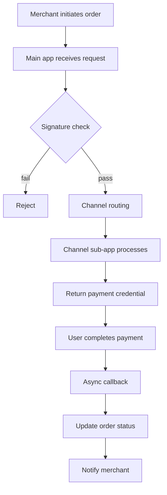
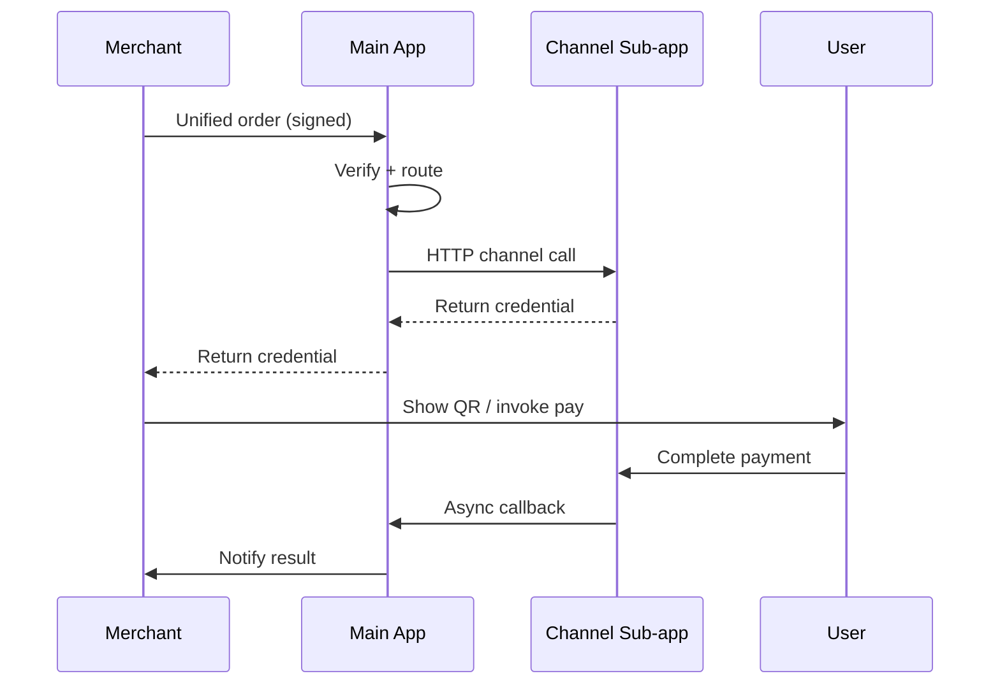
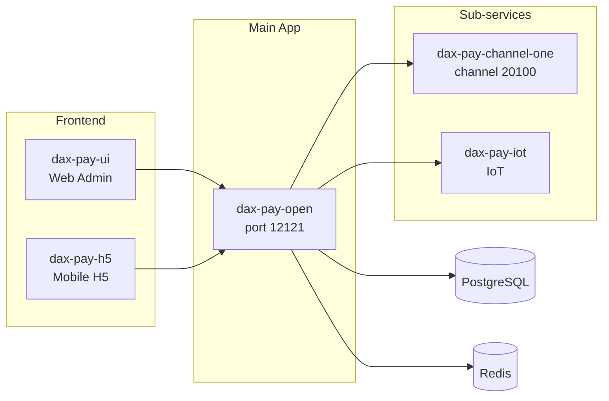
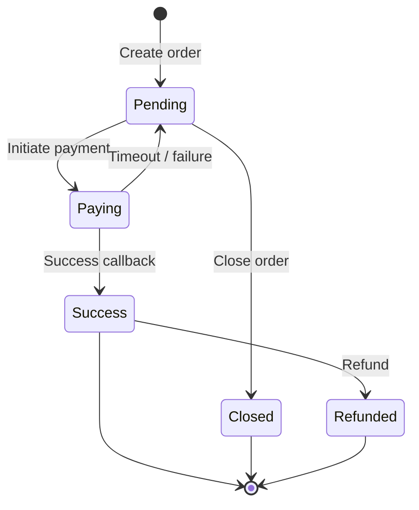
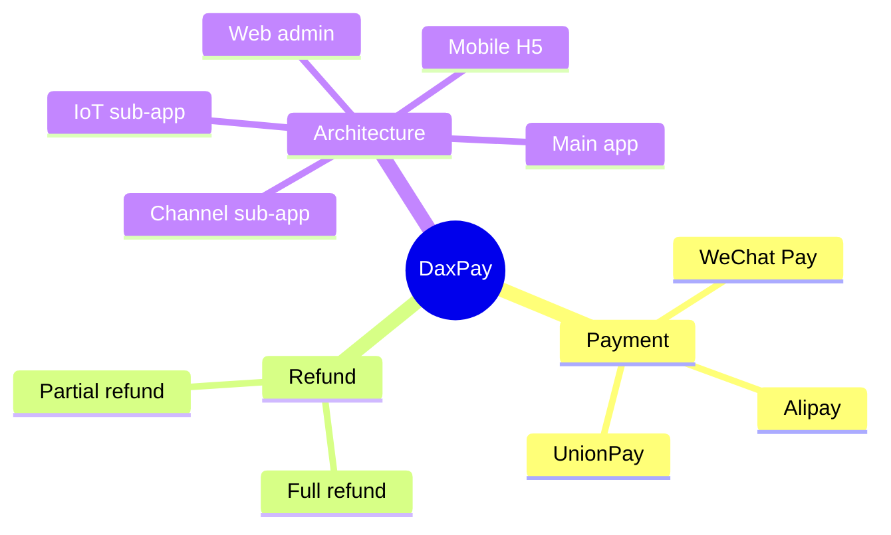

This page demonstrates the two enhanced components supported by the docs site: **Tabs** and **Mermaid diagrams**. Both adapt to light/dark themes, and Mermaid re-renders automatically when the theme changes.

## Tabs

### Basic usage

Wrap content with a `:::tabs` container and separate each tab with `==`. Ideal for parallel options.

:::tabs
== WeChat Pay
Supports JSAPI, Native, QR code, APP, and Mini-Program payments, covering all WeChat scenarios.

== Alipay
Supports desktop website, mobile website, APP, face-to-face, and facial-recognition payments.

== UnionPay
Supports full-channel, gateway, and QR-code payments for bank-card acquiring.
:::

### Code variant

Add `variant:code` to render tabs as a code group — ideal for comparing multiple languages / versions.

:::tabs variant:code
== cURL

```bash
curl -X POST https://api.daxpay.cn/unipay \
  -H "Content-Type: application/json" \
  -H "Accesstoken: ${token}" \
  -d '{"bizOrderNo":"O202601001","amount":100,"channel":"alipay"}'
```

== Java

```java
DaxPayClient client = new DaxPayClient(config);
UnipayParam param = new UnipayParam();
param.setBizOrderNo("O202601001");
param.setAmount(100);
param.setChannel("alipay");
DaxPayResult result = client.execute(param);
```

== PHP

```php
$client = new DaxPayClient($config);
$result = $client->unipay([
    'bizOrderNo' => 'O202601001',
    'amount'     => 100,
    'channel'    => 'alipay',
]);
```
:::

### Shared selection

Multiple tab groups marked with the same `key:name` **share their selection state** — switching one updates all.

:::tabs key:channel
== WeChat Pay
WeChat Pay channel notes and integration points.

== Alipay
Alipay channel notes and integration points.
:::

The group below shares the same `key` as the one above — switching above syncs here:

:::tabs key:channel
== WeChat Pay
- Rate: 0.6%
- Settlement: T+1

== Alipay
- Rate: 0.6%
- Settlement: T+1
:::

### Nested tabs

Use four colons for the outer layer and three for the inner to build hierarchies.

::::tabs
=== Sandbox

:::tabs
== WeChat Pay
Sandbox WeChat Pay configuration.

== Alipay
Sandbox Alipay configuration.
:::

=== Production

:::tabs
== WeChat Pay
Production WeChat Pay configuration.

== Alipay
Production Alipay configuration.
:::
::::

## Mermaid Diagrams

Use a mermaid code block in Markdown to render diagrams — flowcharts, sequence diagrams, architecture graphs, state machines, and more.

### Payment Flow



### Payment & Callback Sequence



### System Architecture



### Order State Machine



## Mind Maps

The docs support two kinds of mind maps: **Mermaid mindmap** (static SVG) and **Markmap** (interactive — collapsible / zoomable).

### Mermaid mindmap (static)



### Markmap (interactive)

Click nodes to collapse / expand, scroll to zoom, drag to pan.

```markmap
# DaxPay
## Payment
### WeChat Pay
### Alipay
### UnionPay
## Refund
### Full refund
### Partial refund
## Architecture
### Main app
### Channel sub-app
### IoT sub-app
### Web admin
### Mobile H5
```
