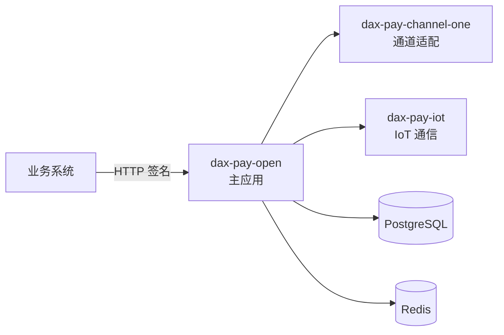

DaxPay 采用 monorepo 组织,主应用通过 HTTP 调用各独立子服务,实现通道 SDK 隔离、独立升级与弹性伸缩。

## 仓库结构

- daxpay-open/
  - **dax-pay-open/** — 主后端应用
  - **dax-pay-channel-one/** — 通道适配子应用
  - **dax-pay-iot/** — IoT 硬件通信子应用
  - **dax-pay-ui/** — Web 管理端
  - **dax-pay-h5/** — 移动 H5 端
  - _config/sql/ — 数据库脚本
  - _doc/ — 设计文档

## 调用关系

## 子项目职责

| 子项目 | 端口 | 职责 |
| ------ | ---- | ---- |
| `dax-pay-open` | 9999 | 支付核心、商户/服务商/代理商、渠道路由、风控、系统管理 |
| `dax-pay-channel-one` | 20100 | 对接单一第三方支付渠道,通道 SDK 依赖隔离 |
| `dax-pay-iot` | — | 云音箱等 IoT 硬件通信 |
| `dax-pay-ui` | 13333 | 运营端 / 商户端管理后台 |
| `dax-pay-h5` | — | 收银台、移动端网关 |

## 技术栈一览

| 层级 | 技术 |
| ---- | ---- |
| 后端 | Java 25 · Spring Boot 4.1 · PostgreSQL 14+ · Redis 7+ |
| Web 端 | Vue 3.5 · Vite 8 · Ant Design Vue Next · Vben Admin 5 · vxe-table 4 |
| H5 端 | Vue 3.5 · Vite 8 · Vant 4 · UnoCSS |
| 权限 | Sa-Token(token name: `Accesstoken`) |
| 接口 | RESTful(kebab-case)· RSA / SM2 签名 |

详细的子项目架构见 [架构设计](../architecture/overview) 板块。
