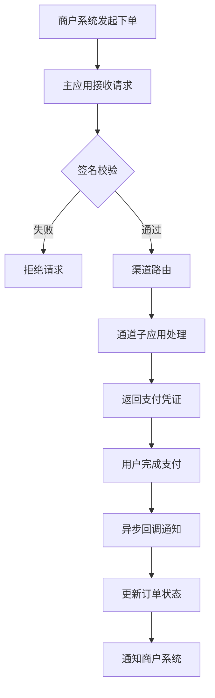
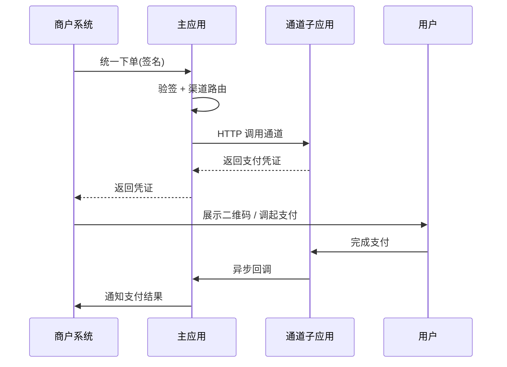
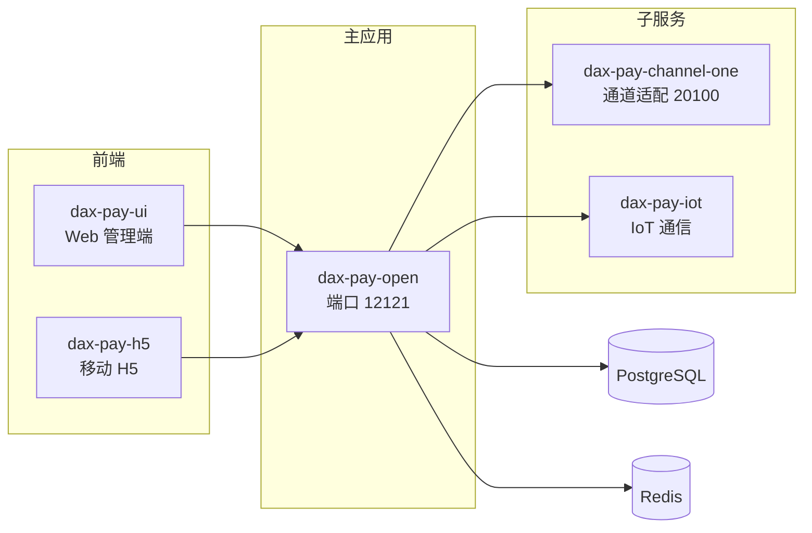
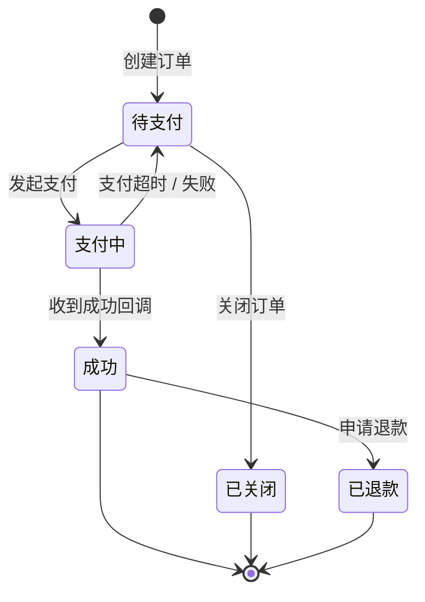
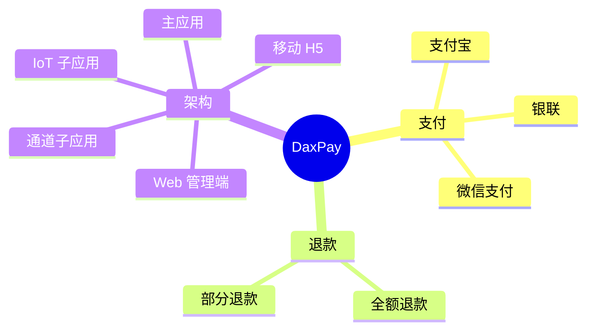

本页演示文档站支持的两类增强组件:**Tabs 标签页**与 **Mermaid 图表**。两者均支持深浅色自适应,Mermaid 会在切换主题时自动重绘。

## Tabs 标签页

### 基础用法

用 `:::tabs` 容器包裹,`==` 分隔各标签页。适合多选项并列的内容。

:::tabs
== 微信支付
支持 JSAPI、Native、扫码、APP、小程序支付,覆盖微信生态全场景。

== 支付宝
支持电脑网站、手机网站、APP、当面付、刷脸支付等主流能力。

== 银联
支持全渠道支付、网关支付、二维码支付,适用于银行卡收单场景。
:::

### 代码示例切换

添加 `variant:code` 可让标签页呈现为代码组样式,适合多语言 / 多版本代码对比。

:::tabs variant:code
== cURL

```bash
curl -X POST https://api.daxpay.cn/unipay \
  -H "Content-Type: application/json" \
  -H "Accesstoken: ${token}" \
  -d '{"bizOrderNo":"O202601001","amount":100,"channel":"alipay"}'
```

== Java

```java
DaxPayClient client = new DaxPayClient(config);
UnipayParam param = new UnipayParam();
param.setBizOrderNo("O202601001");
param.setAmount(100);
param.setChannel("alipay");
DaxPayResult result = client.execute(param);
```

== PHP

```php
$client = new DaxPayClient($config);
$result = $client->unipay([
    'bizOrderNo' => 'O202601001',
    'amount'     => 100,
    'channel'    => 'alipay',
]);
```
:::

### 联动选择

用 `key:名称` 标记的多个标签组会**共享选中状态**,在一处切换即处处同步。

:::tabs key:channel
== 微信支付
微信支付通道说明与对接要点。

== 支付宝
支付宝通道说明与对接要点。
:::

下面这组与上方共享同一个 `key`,切换上方时此处会同步:

:::tabs key:channel
== 微信支付
- 费率:0.6%
- 结算周期:T+1

== 支付宝
- 费率:0.6%
- 结算周期:T+1
:::

### 嵌套标签页

外层用四个冒号,内层用三个冒号,可实现层级切换。

::::tabs
=== 沙箱环境

:::tabs
== 微信支付
沙箱环境微信支付配置说明。

== 支付宝
沙箱环境支付宝配置说明。
:::

=== 生产环境

:::tabs
== 微信支付
生产环境微信支付配置说明。

== 支付宝
生产环境支付宝配置说明。
:::
::::

## Mermaid 图表

在 Markdown 中使用 mermaid 代码块即可渲染图表,支持流程图、时序图、架构图、状态图等。

### 支付流程



### 支付与回调时序



### 系统架构



### 订单状态机



## 思维导图

文档站支持两种思维导图:**Mermaid mindmap**(静态 SVG)与 **Markmap**(可折叠 / 缩放的交互式)。

### Mermaid mindmap(静态)



### Markmap(交互式)

支持点击节点折叠 / 展开、滚轮缩放、拖拽平移。

```markmap
# DaxPay
## 支付
### 微信支付
### 支付宝
### 银联
## 退款
### 全额退款
### 部分退款
## 架构
### 主应用
### 通道子应用
### IoT 子应用
### Web 管理端
### 移动 H5
```
